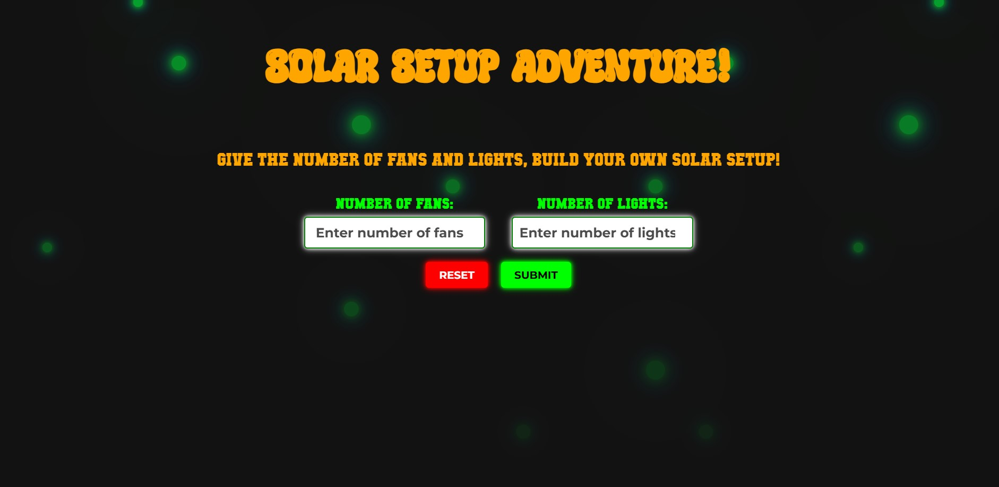
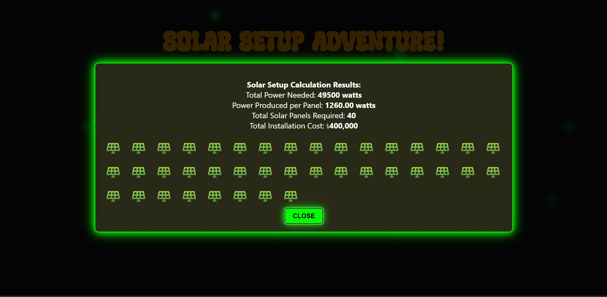

# ☀️ Solar Setup Adventure

A small, fun front-end project that lets you plug in a number of fans and lights and instantly see a rough estimate of the solar panel setup you'd need to power them — panel count and an approximate installation cost, wrapped in a glowing, retro-arcade UI.

## What this actually is

This is **not** a production-grade solar sizing tool. It's a lightweight, playful simulation built to make the idea of "how much solar do I need?" approachable and fun to poke at. Under the hood, it's a plain calculation — no APIs, no backend, no real-world calibration against actual panel specs or location-based solar data. Enter two numbers, get an estimate, enjoy the animation.

## How it works

1. You enter the **number of fans** and **number of lights** you want to run.
2. The app assumes a fixed power draw per device:
   - Fan: 75W
   - Light: 15W
3. It assumes these devices run for an average of **12 hours/day**.
4. It assumes a fixed solar panel spec:
   - Solar radiation: 5.25 kW/m²
   - Panel efficiency: 15%
   - Panel area: 1.6 m²
5. From these fixed assumptions, it calculates:
   - Total daily power needed (watts)
   - Power produced per panel (watts)
   - Number of panels required (rounded up)
   - Estimated total installation cost (at ৳10,000/panel)
6. Results are shown in a pop-up dialog, along with a little grid of panel icons representing how many panels you'd need.

## Tech stack

- Plain **HTML**, **CSS**, and **vanilla JavaScript** — no frameworks, no build step.
- A typewriter-effect intro line, animated glowing background particles, and a neon-styled results dialog for visual flair.
- Custom fonts (`Super Shiny`, `Mutant`, `Bruce`) for the retro/arcade aesthetic — make sure the corresponding font files sit alongside `solar.css`.
## Screenshot

### Results Dialog

## Files

| File | Purpose |
|---|---|
| `index.html` | Markup, input fields, buttons, results dialog, and the calculation/animation logic |
| `solar.css` | All styling — background animation, glowing inputs/buttons, dialog theme, panel grid |
| `solar_cell.png` | Icon used to represent each solar panel in the results grid (must be provided alongside these files) |

## Running it

No build tools needed. Just open `index.html` in a browser. Make sure `solar.css`, `solar_cell.png`, and the three `.ttf` font files referenced in the CSS are in the same folder.

## Known limitations (by design)

- Fixed, hardcoded power-per-device and solar-radiation values — not location-aware or configurable.
- No battery/storage sizing, no inverter losses, no seasonal variation.
- No input validation beyond defaulting empty fields to zero.
- Currency is hardcoded to BDT (৳) with a flat per-panel cost.

If you ever want to turn this into something more realistic, the natural next steps would be pulling in actual location-based solar irradiance, letting users pick appliance types with real wattages, and accounting for system losses — but that's outside the scope of what this project is trying to be. This one's meant to stay small and fun.
